# Power BI

## Introduction
Le monde de l’entreprise est de plus en plus piloté par les données. Les petites et grandes entreprises utilisent des données pour prendre des décisions sur les ventes, les embauches, les objectifs et tous les domaines pour lesquels elles ont des données. Alors que la plupart des entreprises ont accès aux données d’un type ou d’un autre, il peut être intimidant d’essayer de comprendre sans un arrière-plan dans les analyses de données ou les statistiques. Même si vous comprenez les données, il peut être nécessaire d’afficher les données d’une manière facile à comprendre et de les communiquer à d’autres personnes pertinentes. Power BI permet d’ôter l’intimidation et les ennuis de l’analyse et de la visualisation des données. En vous connectant à une ou plusieurs centaines de sources de données existantes et en utilisant une interface sécurisée et facile à comprendre, vous pouvez rapidement et facilement interagir avec et comprendre vos données pour influencer tous les systèmes de l’entreprise.

Dans ce module, vous allez :
* Décrire la valeur commerciale et les fonctionnalités de Power BI
* Découvrir comment Power BI fonctionne et examine le point de vue de l’utilisateur
  
## Qu’est-ce que Power BI ?

Des données relatives aux clients et aux employés, des métriques pour les objectifs de l’entreprise, aux ventes et aux acquisitions, les entreprises sont submergées de données, mais ces données ne sont utiles que si vous avez la capacité à interpréter et à communiquer leur signification. C’est là qu’intervient Power BI (Business Intelligence).

Microsoft Power BI est un ensemble de services logiciels, d’applications et de connecteurs qui fonctionnent ensemble pour transformer des sources de données sans rapport en insights cohérents, visuellement immersifs et interactifs. Que vos données se trouvent dans un simple classeur Microsoft Excel ou dans un ensemble d’entrepôts de données hybrides locaux et dans le cloud, Power BI vous permet d’interagir facilement avec vos sources de données, de nettoyer et de modéliser vos données sans affecter la source sous-jacente, de visualiser (ou de découvrir) les éléments importants et de partager ces informations avec les personnes de votre choix ou publiquement si vous le souhaitez.

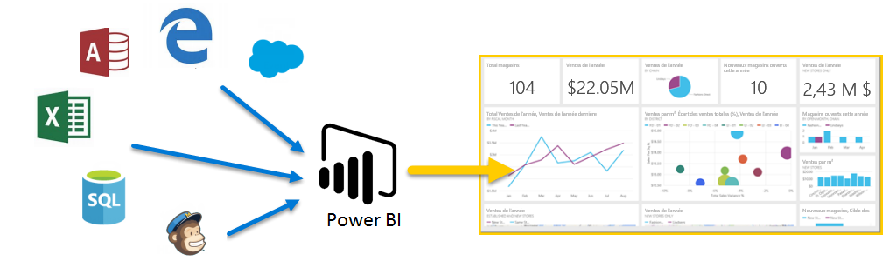

## Composants de Power BI
Power BI se compose d’une application de bureau Microsoft Windows appelée Power BI Desktop, d’un service SaaS en ligne (Software as a Service ou logiciel en tant que service) appelé service Power BI et d’applications mobiles Power BI disponibles sur les téléphones et tablettes.

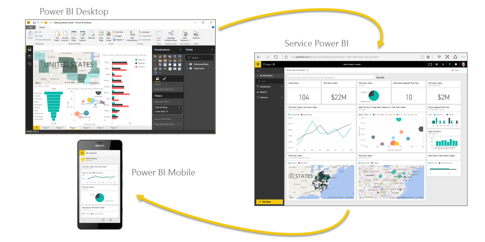

Ces trois éléments (Desktop, service et applications Mobile) sont conçus pour permettre aux utilisateurs de créer, de partager et de consommer efficacement des analyses commerciales en fonction de leur rôle et de leurs besoins.

## Capacités
Les capacités sont un concept fondamental de Power BI ; elles représentent un ensemble de ressources utilisées pour héberger et distribuer votre contenu Power BI. Les capacités sont partagées ou dédiées. Une capacité partagée l’est entre d’autres clients Microsoft, tandis qu’une capacité dédiée est entièrement consacrée à un seul client. Les capacités dédiées nécessitent un abonnement. Par défaut, les espaces de travail sont créés sur une capacité partagée.

## Workspaces
Les espaces de travail sont des conteneurs pour les tableaux de bord, rapports, jeux de données et dataflows dans Power BI. Il existe deux types d’espaces de travail : Mon espace de travail et les espaces de travail.

* **Mon espace de travail** est l’espace de travail personnel qui permet à un client Power BI de travailler avec son propre contenu. Vous êtes le seul utilisateur à avoir accès à Mon espace de travail. Vous pouvez partager des tableaux de bord et des rapports à partir de votre espace Mon espace de travail. Pour collaborer sur des tableaux de bord et des rapports ou créer une application, vous devez travailler dans un espace de travail.

* Les **espaces de travail** permettent de collaborer et de partager du contenu avec vos collègues. Vous pouvez ajouter des collègues à vos espaces de travail et collaborer sur des tableaux de bord, des rapports et des jeux de données. Avec une exception, tous les membres de l’espace de travail doivent disposer de licences Power BI Pro.

Les espaces de travail sont également là où vous créez, publiez et gérez des applications pour votre organisation. Considérez les espaces de travail comme des zones intermédiaires et des conteneurs pour le contenu d’une application Power BI. Qu’est-ce qu’une *application* ? Une application est une collection de tableaux de bord et de rapports destinés à fournir des mesures clés aux consommateurs de Power BI dans votre organisation. Les applications sont interactives mais les consommateurs ne peuvent pas les modifier. Les consommateurs d’applications, les collègues qui ont accès aux applications, n’ont pas nécessairement besoin de licences Pro.

## Jeux de données

Un **jeu de données** est une collection de données que vous importez ou auxquelles vous vous connectez. Power BI vous permet de vous connecter à toutes sortes de jeux de données regroupés au même endroit et de les importer dans un même emplacement. Les jeux de données peuvent également fournir des données provenant de dataflows.

Les jeux de données associés aux espaces de travail et un même jeu de données peuvent faire partie de nombreux espaces de travail. Lorsque vous ouvrez un espace de travail, les jeux de données associés sont répertoriés sous l’onglet **Jeux de données**. Chaque jeu de données répertorié représente une source de données unique, telle qu’un classeur Excel sur OneDrive, un jeu de données tabulaires SSAS locales ou un jeu de données Salesforce. De nombreuses sources de données différentes sont prises en charge. Les jeux de données ajoutés par un membre de cet espace de travail sont accessibles pour les autres membres de l’espace de travail avec un rôle administrateur, membre ou contributeur.

## Datasets partagés

Le décisionnel est une activité de collaboration. Il est important de définir des jeux de données normalisés qui peuvent constituer la « source de vérité ». La découverte et la réutilisation de ces jeux de données normalisés sont un atout primordial. Quand les modélisateurs de données expérimentés de votre organisation créent et partagent des jeux de données optimisés, les créateurs de rapports peuvent démarrer avec ces jeux de données pour générer des rapports précis. Votre organisation peut avoir des données cohérentes pour prendre des décisions et une culture de données saine. Pour utiliser ces jeu de données partagés, choisissez **jeux de données Power BI** lors de la création de votre rapport Power BI.

## Rapports

Un rapport Power BI correspond à une ou plusieurs pages de visualisations comme des graphiques en courbes, des cartes et des treemaps. Les visualisations sont également appelées visuels. Vous pouvez créer des rapports de toute pièce dans Power BI, les importer avec les tableaux de bord que des collègues partagent avec vous, ou Power BI peut les créer automatiquement quand vous vous connectez à des jeux de données à partir d’Excel, de Power BI Desktop, de bases de données et d’applications SaaS. Par exemple, quand vous vous connectez à un classeur Excel qui contient des feuilles Power View, Power BI crée un rapport basé sur ces feuilles. Et quand vous vous connectez à une application SaaS, Power BI importe un rapport prédéfini.

Il existe deux modes d’affichage et d’interaction pour les rapports : Mode Lecture et mode Édition. Lorsque vous ouvrez un rapport, celui-ci s’ouvre en mode Lecture. Si vous disposez des autorisations de modification, vous voyez Modifier le rapport dans le coin supérieur gauche, et vous pouvez afficher le rapport en mode Édition. Si un rapport se trouve dans un espace de travail, toute personne disposant d'un rôle administrateur, membre ou contributeur peut le modifier. Ces personnes ont accès à toutes les fonctionnalités d’exploration, de conception, de création et de partage du mode Édition pour ce rapport. Les personnes avec qui ils partagent le rapport peuvent l’explorer et interagir avec lui en mode Lecture.

Lorsque vous ouvrez un espace de travail, les rapports associés sont répertoriés sous l’onglet **Rapports**. Chaque rapport répertorié représente une ou plusieurs pages de visualisations basées sur un seul des jeux de données sous-jacents. Pour ouvrir un rapport, sélectionnez-le.

Lorsque vous ouvrez une application, vous voyez un tableau de bord. Pour accéder à un rapport sous-jacent, sélectionnez une vignette de tableau de bord (nous approfondirons ce sujet ultérieurement) qui a été épinglée à partir d’un rapport. Gardez à l’esprit que toutes les vignettes ne sont pas épinglées à partir de rapports. Vous devrez donc peut-être cliquer sur quelques vignettes pour trouver un rapport.

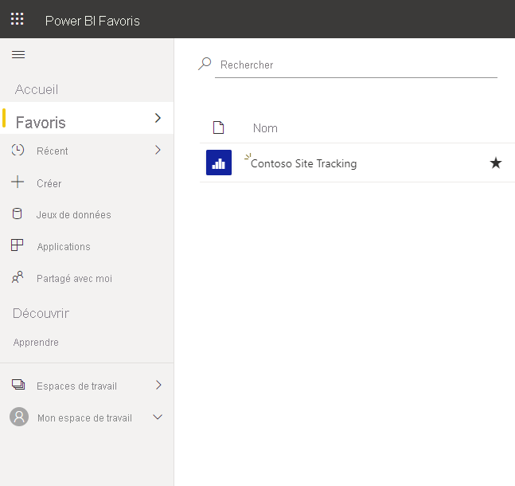

Par défaut, le rapport s’ouvre en mode Lecture. Sélectionnez **Modifier le rapport** pour l’ouvrir en Mode Édition (si vous avez les autorisations requises).

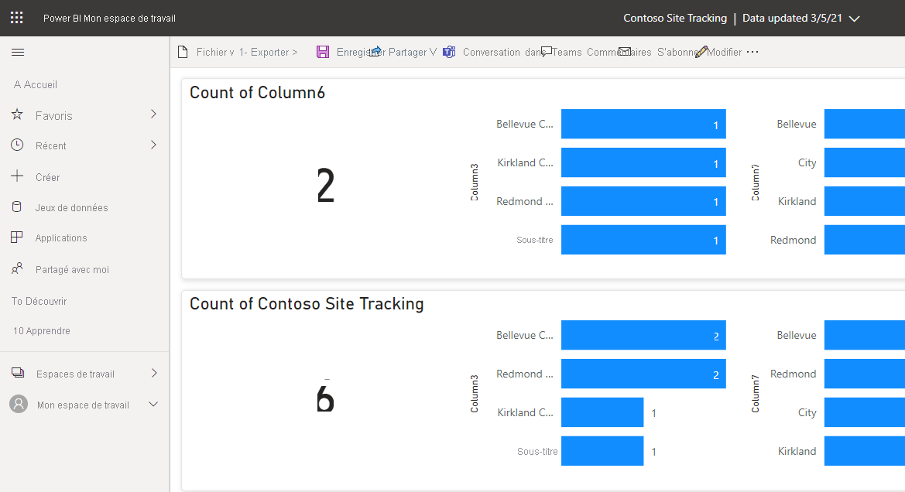

## Tableaux de bord

Un tableau de bord est un élément que vous créez dans **Power BI** ou qu’un collègue crée dans le **service Power BI** et partage avec vous. Il s’agit d’un canevas unique qui contient zéro vignette et widget ou plus. Chaque vignette épinglée à partir d’un rapport ou de la zone Questions et réponses affiche une visualisation unique qui a été créée à partir d’un jeu de données et épinglée au tableau de bord. Des pages de rapport entières peuvent aussi être épinglées à un tableau de bord sous forme de vignette unique. Il existe plusieurs façons d’ajouter des vignettes à votre tableau de bord, bien trop nombreuses pour être traitées dans cette rubrique de présentation.

Pourquoi créer des tableaux de bord ? En voici quelques raisons :
* Pour voir en un coup d’œil toutes les informations nécessaires pour prendre des décisions.
* Pour superviser les informations les plus importantes concernant votre activité.
* Pour vous assurer que tous vos collègues accèdent à la même page, et qu’ils consultent et utilisent les mêmes informations que vous.
* Pour surveiller la santé d’une entreprise, d’un produit, d’une unité organisationnelle, d’une campagne marketing, etc.
* Pour créer une vue personnalisée d’un tableau de bord plus large et afficher les métriques qui les intéressent.
  
Lorsque vous ouvrez un espace de travail, les tableaux de bord associés sont répertoriés sous l’onglet Tableaux de bord. Pour ouvrir un tableau de bord, sélectionnez-le. Lorsque vous ouvrez une application, vous voyez un tableau de bord. Si vous êtes propriétaire du tableau de bord, vous avez aussi accès en modification aux jeux de données et rapports sous-jacents. Si le tableau de bord a été partagé avec vous, vous pouvez interagir avec le tableau de bord et les rapports sous-jacents, mais vous ne pouvez pas enregistrer de modifications.

## Applications modèles

Les nouvelles applications modèles Power BI permettent aux partenaires Power BI de créer des applications Power BI avec peu ou pas de codage et de les déployer ensuite vers n’importe quel client Power BI. En tant que partenaire Power BI, vous créez du contenu prêt à l’emploi pour vos clients et vous le publiez vous-même.

Vous pouvez concevoir des applications modèles qui permettent à vos clients de se connecter à partir de leurs propres comptes. En tant qu’experts dans leur domaine, les clients peuvent déverrouiller les données pour les rendre facilement consommables par leurs utilisateurs professionnels.

Les applications de modèle sont envoyées à l’espace partenaires pour devenir publiquement disponibles dans le [Marketplace Power BI Apps](https://app.powerbi.com/getdata/services) et sur [Microsoft AppSource](https://appsource.microsoft.com/fr-FR?product=power-bi). Si vous souhaitez créer vous-même des applications modèles pour les distribuer en dehors de votre organisation, consultez [Créer une application modèle dans Power BI](https://docs.microsoft.com/fr-fr/power-bi/connect-data/service-template-apps-create).

## Installer une application modèle
1. Dans le volet de navigation du service Power BI, sélectionnez **Applications** > **Obtenir des applications**.
   
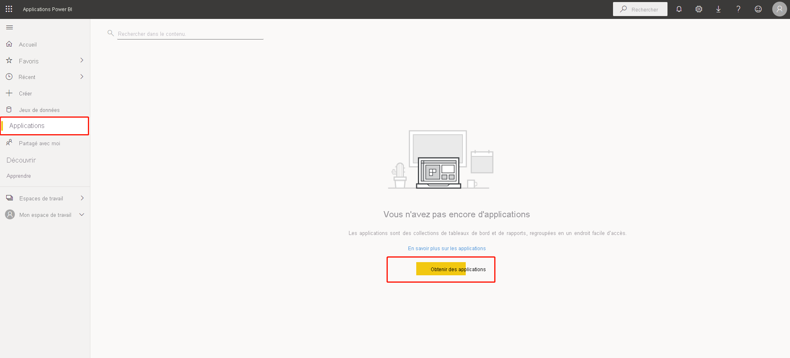

2. Dans la Place de marché des applications Power BI qui s’affiche, sélectionnez **Applications modèles**s. Toutes les applications modèles disponibles dans AppSource sont affichées. Recherchez l’application modèle que vous recherchez, ou obtenez une sélection filtrée à l’aide de la zone de recherche.
    
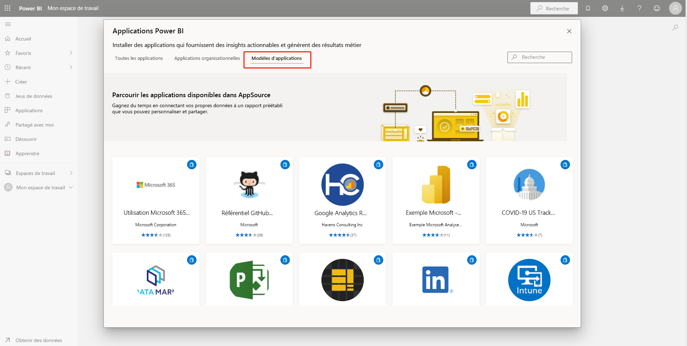

3. Lorsque vous trouvez l’application modèle que vous recherchez, cliquez dessus. L’offre de l’application modèle s’affiche. Cliquez sur OBTENIR MAINTENANT.

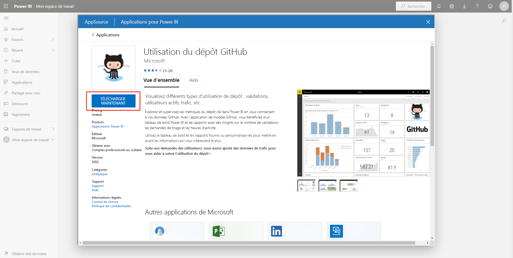

4. Dans la boîte de dialogue qui s’affiche, sélectionnez Installer.

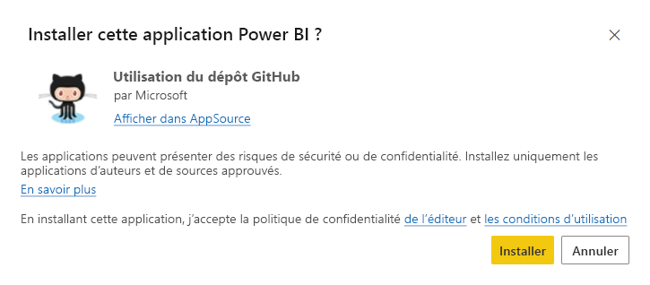

L’application est installée, ainsi qu’un espace de travail portant le même nom que tous les artefacts nécessaires pour une [personnalisation](https://docs.microsoft.com/fr-fr/power-bi/connect-data/service-template-apps-install-distribute#customize-and-share-the-app) plus poussée.

---
**NOTE**

Si vous utilisez un lien d’installation pour une application qui n’est pas listée sur AppSource, une boîte de dialogue de validation vous invite à confirmer votre choix.

---
---
Pour pouvoir installer une application modèle qui n’est pas listée sur AppSource, vous devez demander les autorisations appropriées à votre administrateur. Consultez [Paramètres d’application modèle](https://docs.microsoft.com/fr-fr/power-bi/admin/service-admin-portal#template-apps-settings) dans le portail d’administration Power BI pour plus d’informations.

---

Une fois l’installation terminée, une notification vous indique que votre nouvelle application est prête.

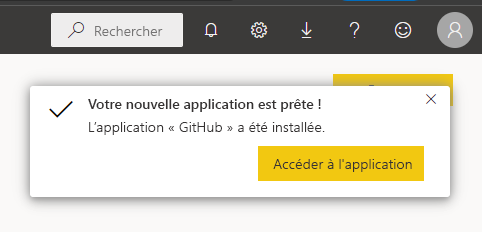

## Modélisation et visualisations des données
Quand vous lancez Power BI Desktop, la boîte de dialogue Prise en main s’affiche. Elle fournit des liens utiles vers des forums, des blogs et des vidéos d’introduction.

Dans Power BI Desktop, vous commencerez à créer des rapports dans la vue **Rapport**. Vous travaillerez dans cinq zones principales :

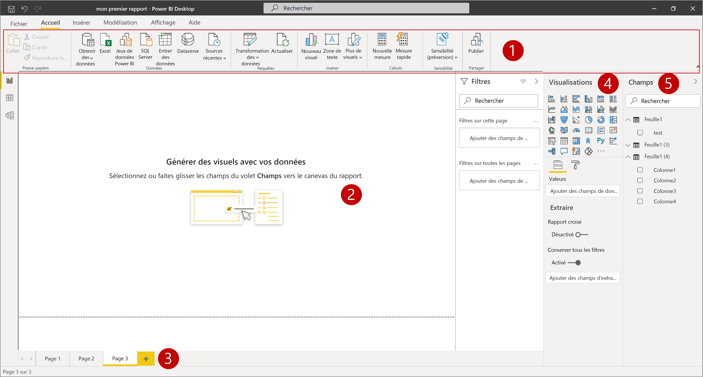

1. **Ruban** - Affiche les tâches courantes associées aux rapports et aux visualisations.
   
2. **Vue Rapport, ou canevas** - Sert à créer et à organiser les visualisations.
   <ol type="a">
    <li> La <b>Vue de données</b> vous permet d’afficher toutes les données disponibles dans votre rapport. Il s’agit d’un moyen simple de vérifier rapidement les types de données et de valider les données.</li>
    <li>L’<b>Affichage de modèles</b> dans Power BI Desktop vous permet de définir visuellement la relation entre les tableaux ou les éléments. Une relation se produit lorsque deux tables ou plus sont liées, car elles contiennent des données associées. Cela permet aux utilisateurs d’exécuter des requêtes dans plusieurs tableaux pour des données liées.</li>
    </ol>

3.  **Onglet Pages** - Situé en bas de la page, cette zone vous permet de sélectionner ou d’ajouter une page de rapport.
   
4. **Volet Visualisations** - Vous permet de modifier les visualisations, de personnaliser les couleurs ou les axes, d’appliquer des filtres, de faire glisser des champs, et ainsi de suite.
   
5. **Volet Champs** - Vous permet de faire glisser des éléments de requête et des filtres vers la vue Rapport, ou vers la zone Filtres du volet Visualisations.

## Types de visualisations disponibles dans Power BI

Voici quelques-uns des nombreux types de visualisations qui peuvent être ajoutés aux rapports Power BI, spécifiés dans Q&R et épinglés aux tableaux de bord.

### Graphiques en aires : De base (superposées) et empilées

Le graphique en aires de base est basé sur le graphique en courbes, avec la zone comprise entre l’axe et la ligne remplie.

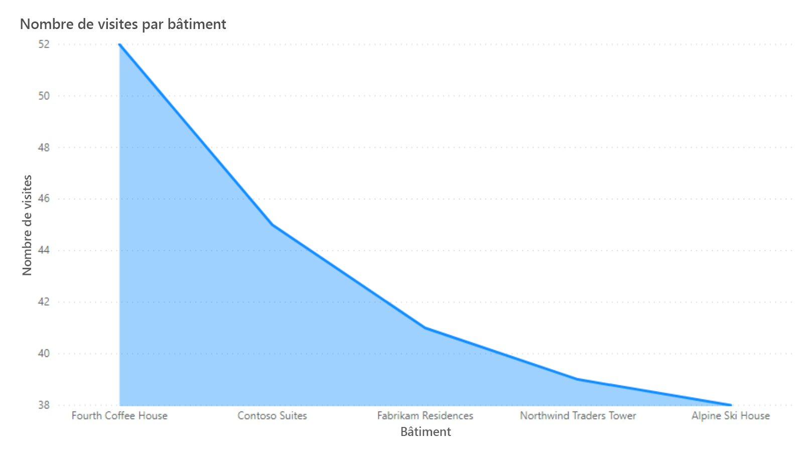
